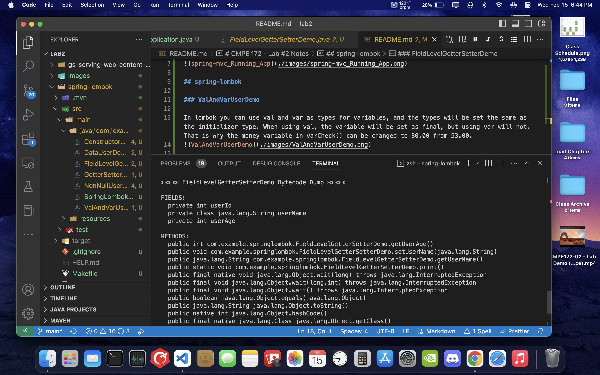

# CMPE 172 - Lab #2 Notes

## spring-mvc

## spring-lombok

### ValAndVarUserDemo

In lombok you can use val and var as types for variables, and the types will be set the same as the initializer type. When using val, the variable will be set as final, but using var will not. That is why the money variable in varCheck() can be changed to 80.00 from 53.00.

### FieldLevelGetterSetterDemo

With lombok you can use the @Getter and @Setter annotation to automatically generate getter and sett methods for variables. In this example userID got no getter or setter methods while the variable userAge got a getter method and the variable userName got both a getter and a setter method.

### GetterSetterUserDemo

With lombok, when using the @Getter and @Setter annotation on a class, then lombok will automatically generate getters and setters method for all field variable in the class. In this example each variable got both a setter and a getter method.

### ConstructorUserDemo.java

With lombok you can use the @@NoArgsConstructor or the @AllArgsConstructor annotation to generate a default constructor for each variable in the class. In this example both of the annotation is used resulting in the overloading of two type of constructor: one with no arguments and one with all of the variable as argument.

### DataUserDemo

The @Data annotation in lombok is a combination of @ToString, @EqualsAndHashCode, @Getter, @Setter, and @RequiredArgsConstructor. Using this annotation on a class will generate getters for all variables, setters for all non-final fields, a default toString method, an equals and hashCode method, and a constructor.

### NonNullUserDemo

Using the @NonNull annotation on a parameter will check it for a null value. In our example, we created a NonNullUserDemo object but set userName as Null. This had caused the initialization to fail and a NullPointerException was thrown.

