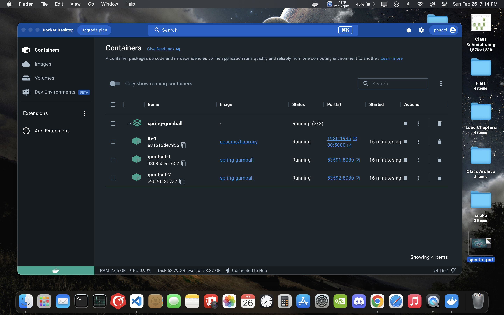
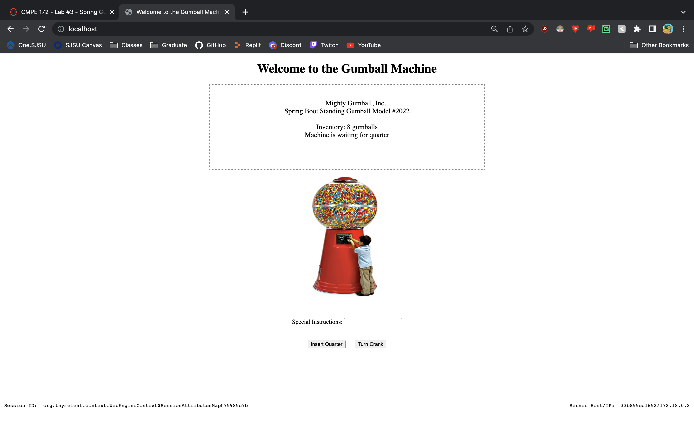
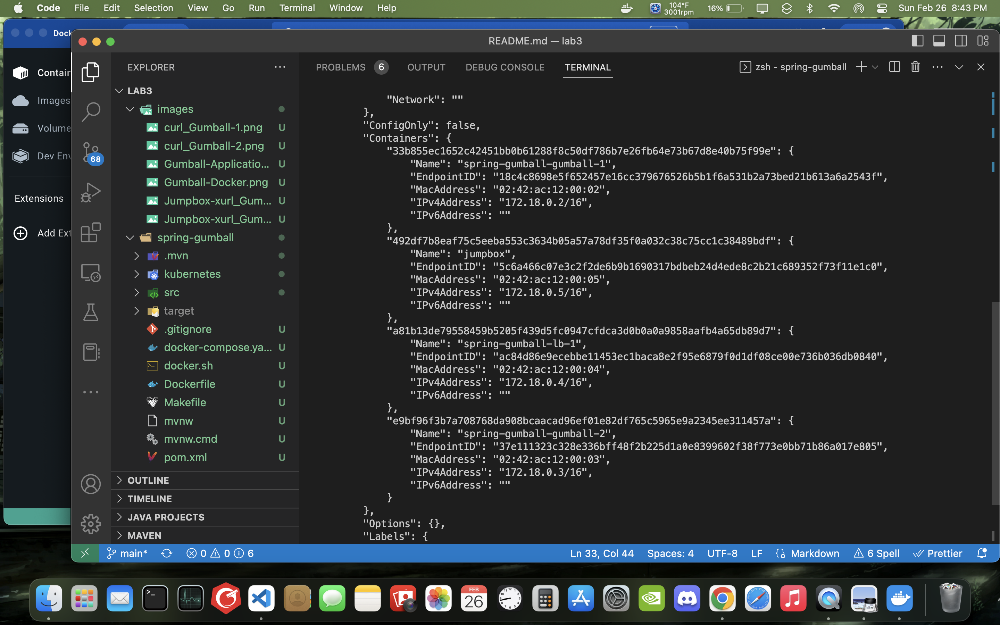
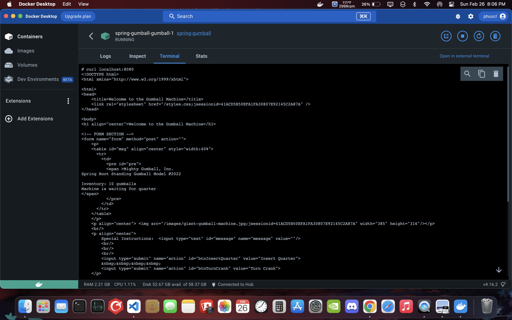
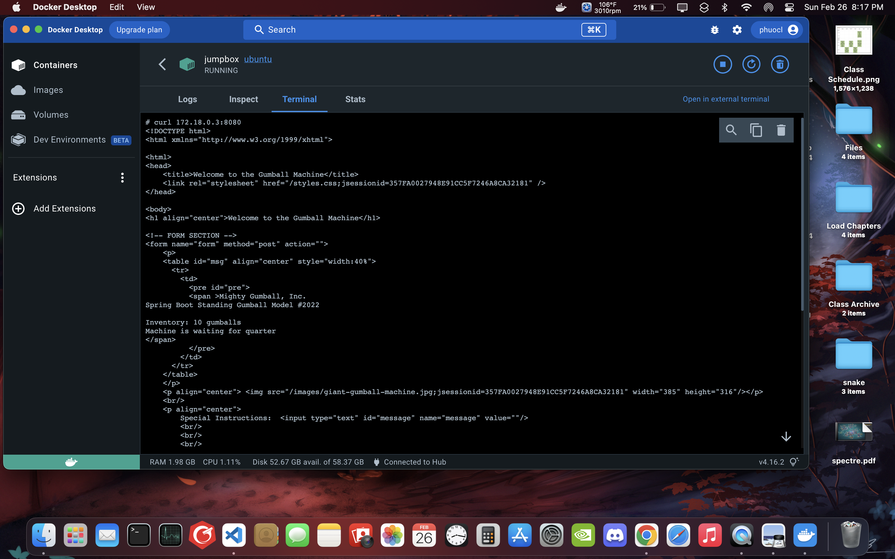

# CMPE 172 - Lab #3 Notes

## Screenshots of deployment to Docker via Docker Compose

## Observations and Answers to Questions

### When you load the page multiple times what do you see on the Gumball Home Pages for Server Host/IP?

    If you reload the page multiple times, you will see that you will be Round-robin between server 2 and 3.

### Can you explain where that IP value comes from?

    The IP comes from each of the running container that the user is currently on.

### Now, try to add some quarters and purchase some gumballs

### Do you see the inventory depleting?  Are there any errors?

    There is the nullPointerException error.

### Review to code for your answer.  No need to make any code changes to fix any issue

### Look at the Session State Feature of the HA Load balancer (using COOKIES_ENABLED)

### Is there a setting that can avoid the error?  Why does it work (or Why not)

    Turning COOKIES_ENABLED to true, the issue is solved because now the user's data and cookie are on the same container as the session and the nullPointerException error should not happen.

## Screenshots for some Testing via Jumpbox

