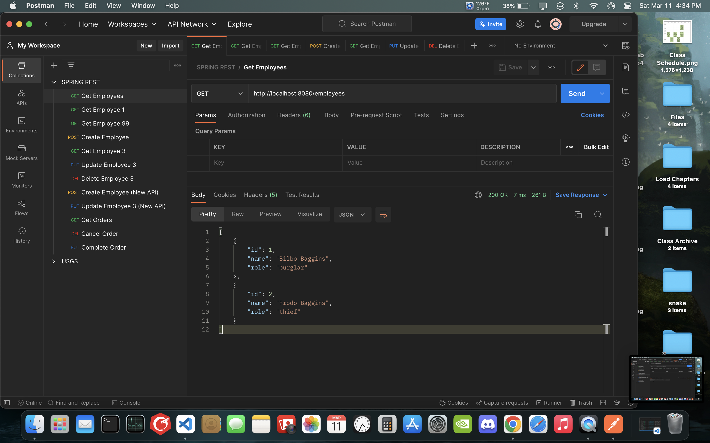

# CMPE 172 - Lab #5 Notes

## Spring-Rest-Level2

Running the Spring-Rest-Level2 application and testing with Postman

Get request for all employees

Get request for employee 1

Get request for employee 99, which does not exist in the database

Post request to create new employee with the name Samwise Gamgee and role of Gardener

Get request for employee 3

Get request for all employees, which now contain the third employee

Put request to update the third employee's role to ring bearer

Get request for all employees, which now show the third employee as ring bearer

Del request to delete the third employee from the database

Get request for all employees, showing the third employee has been deleted

## Spring-Rest-Level3

Running the Spring-Rest-Level3 application where a field is evolved but old data is retained for backward compatibility, and testing with Postman

Get request for all employees

Get request for employee 1

Get request for employee 99, which does not exist in the database

Post request to create new employee with the name Samwise Gamgee and role of Gardener

Get request for employee 3

Put request to update the third employee's role to ring bearer

Get request for employees 3, which now show the third employee as ring bearer

Del request to delete the third employee from the database

Get request for employee 3, showing the third employee has been deleted

Post request to add a new employee with a first name and last name separately

Get request for all employees, showing that the new employee was successfully added without issue

Put request to update the role of the new employee to ring bearer

