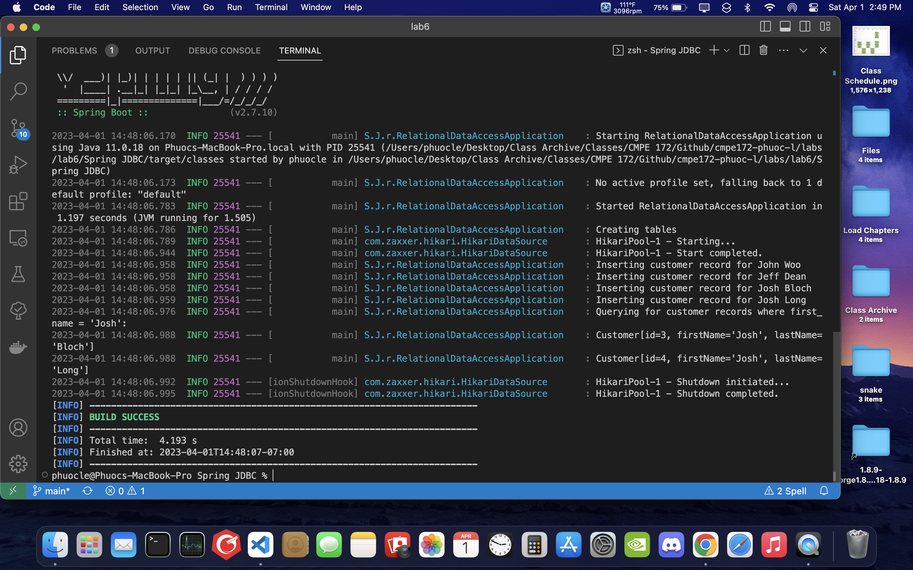
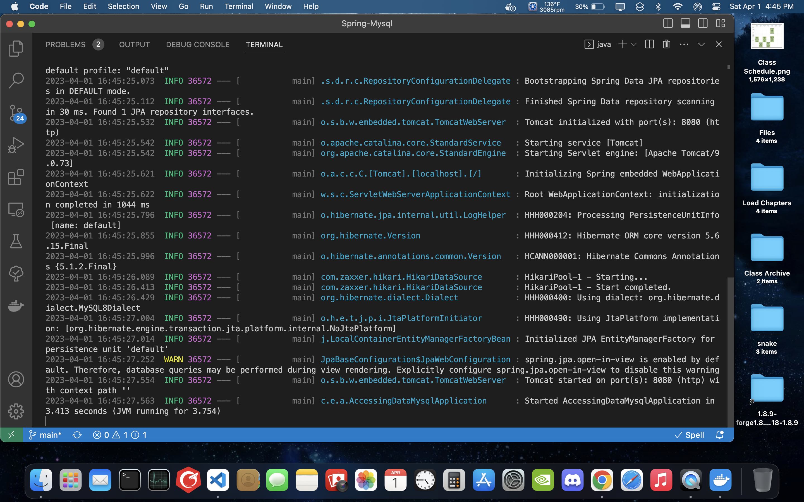
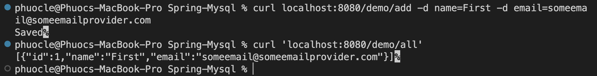
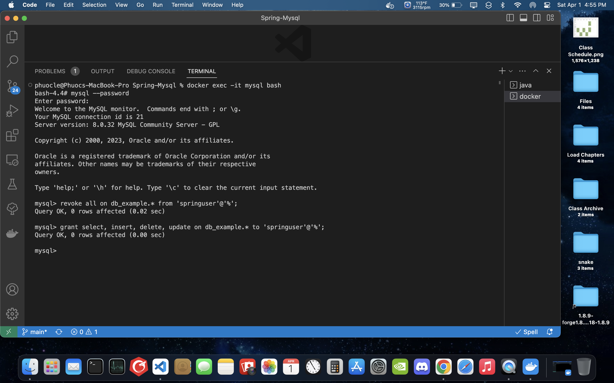
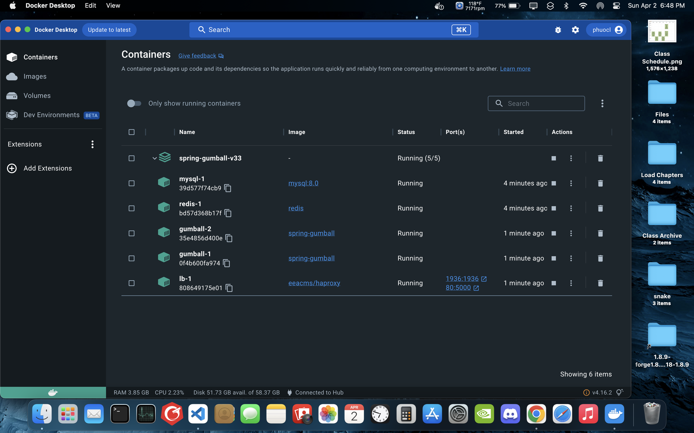
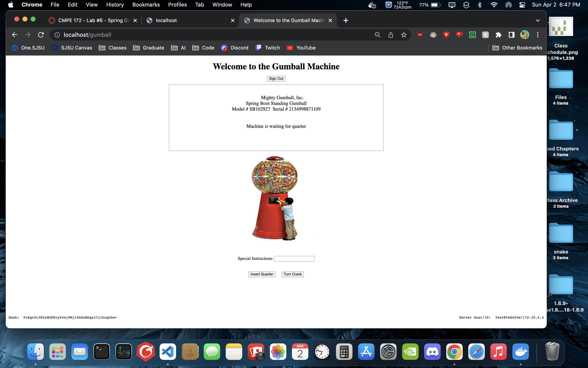
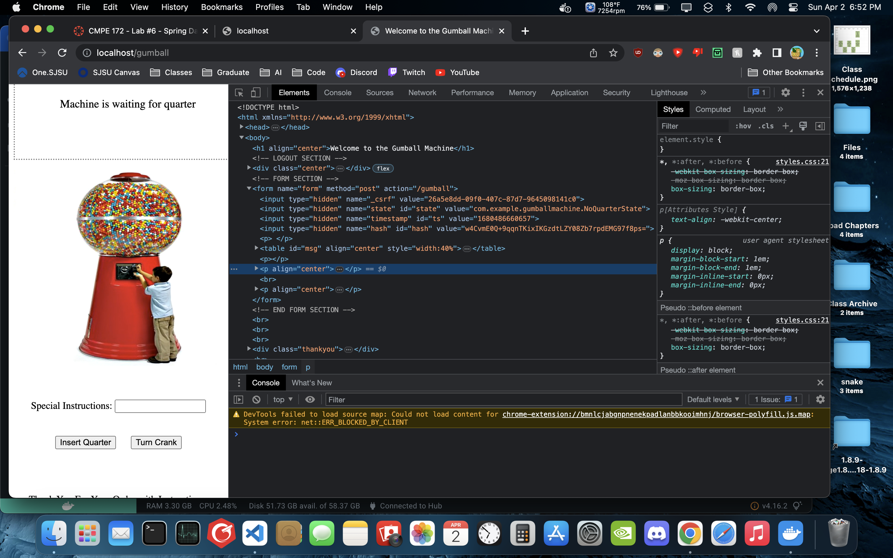
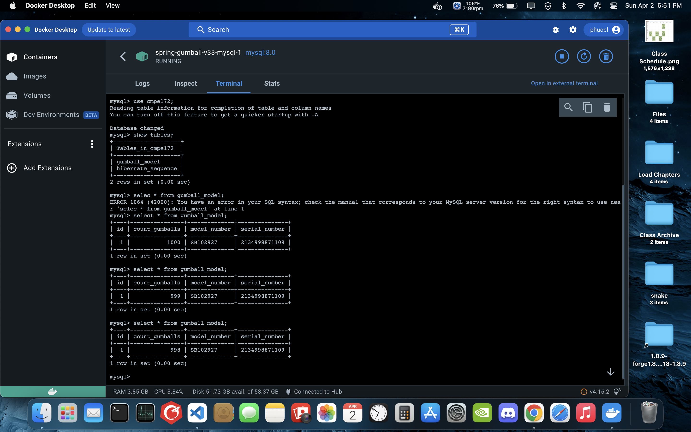

# CMPE 172 - Lab #6 Notes

## Spring-JDBC

Running Spring-JDBC: the customer database was initialized and a table for customer data is created. Four customers name were inserted and queried.

## Spring-Mysql

Running Spring-Mysql

Testing the Spring-Mysql application: Create a user in the database, and then display it.

Security Changes in the Spring-Mysql application: Only allow users access to commands grant, select, insert, and delete.

## Spring-Gumball-V3

Running Spring-Gumball-V3 with mysql and redis.

Spring-Gumball-V3 web application (with hash).

Spring-Gumball-V3 HTML Source of the Page showing hidden fields, after buying some gumballs.

Spring-Gumball-V3 gumball database table showing inventory after buying some gumballs.

