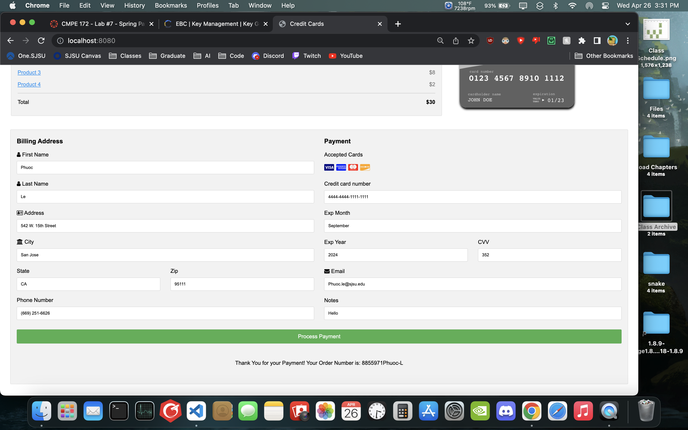
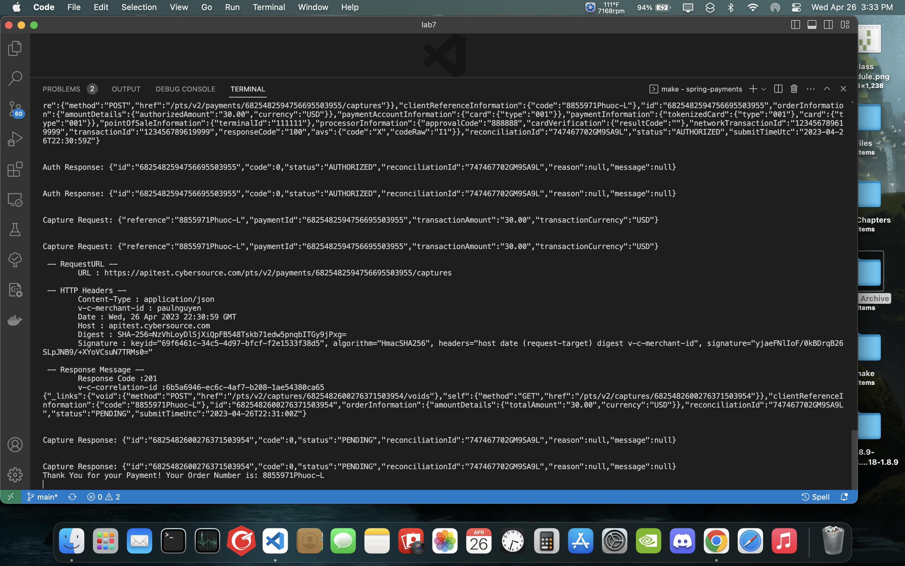
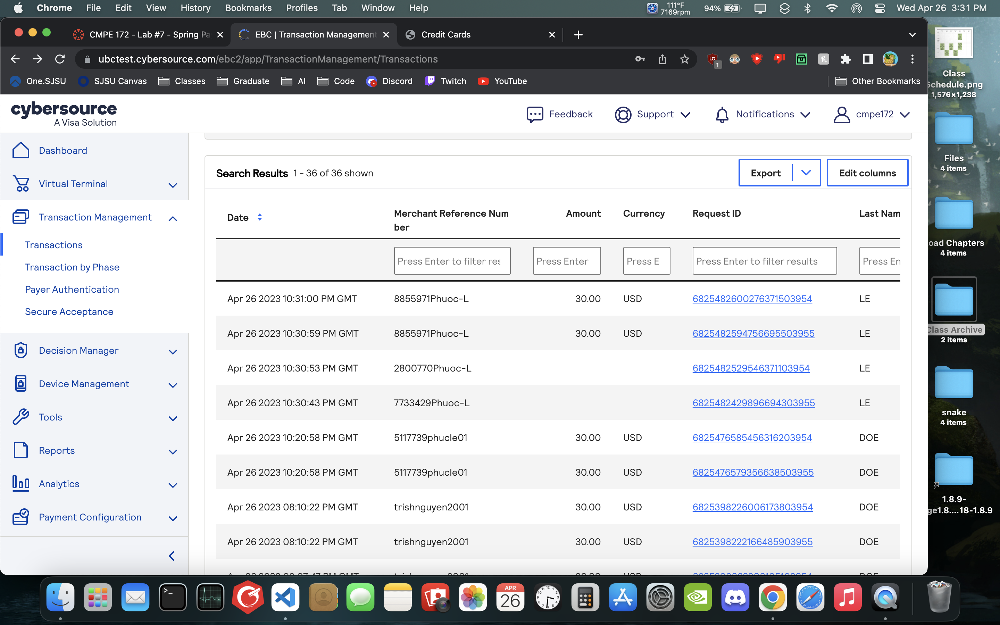
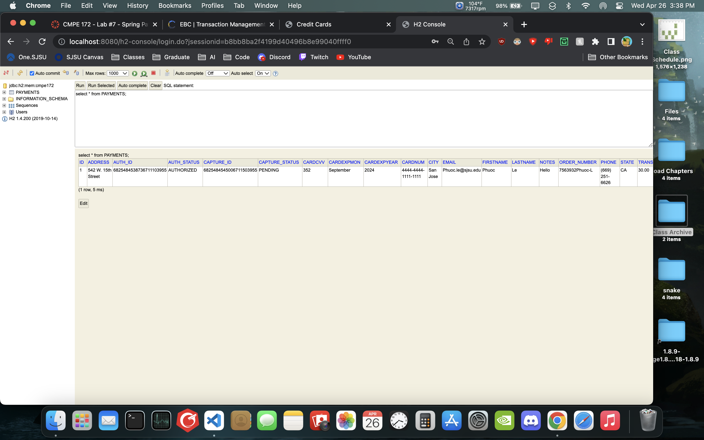
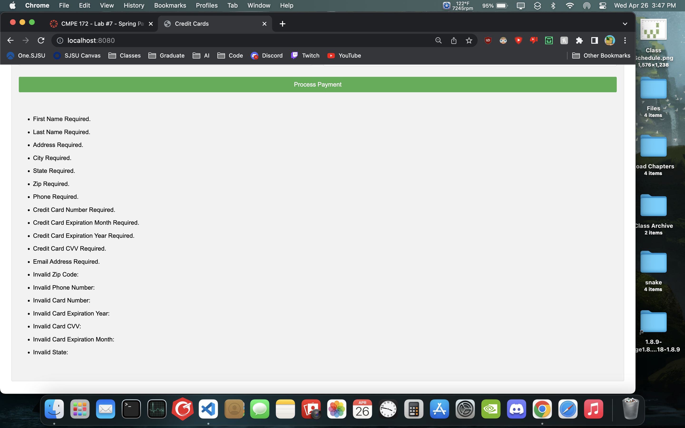
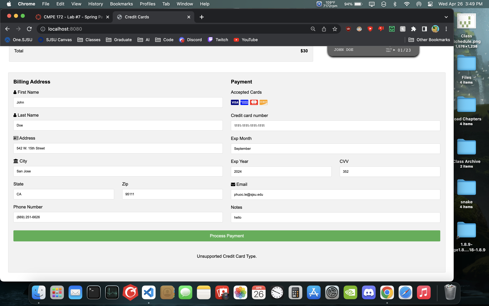

# CMPE 172 - Lab #7 Notes

## Spring-Payments

    Payment page with process payment output

    Terminal containing process imformation

    CyberSource transaction dashboard showing successful transaction

    H2 console displaying successful save of payment information

    Payment error when all fields are left empty

    Payment error when there is only one error

## Discussion

### Discussion of the Lombok, ThymeLeaf and Spring Features you used in this Lab

- Lombok is used to auto generate all setters and getters for any class, in this case, we are using it for the PaymentsCommand class. ThymeLeaf is used as a template engine to process code in html files. In spring payments, thyme leaf was used to process all front end ui elements to carry data to the backend for processing.

### Discuss why Jackson is needed and where it is used in the code for this Lab

- jackson is used for the processing and parsing of json data in java. It is used in spring payments because of the api request and response from the cybersource api will be in json format.
