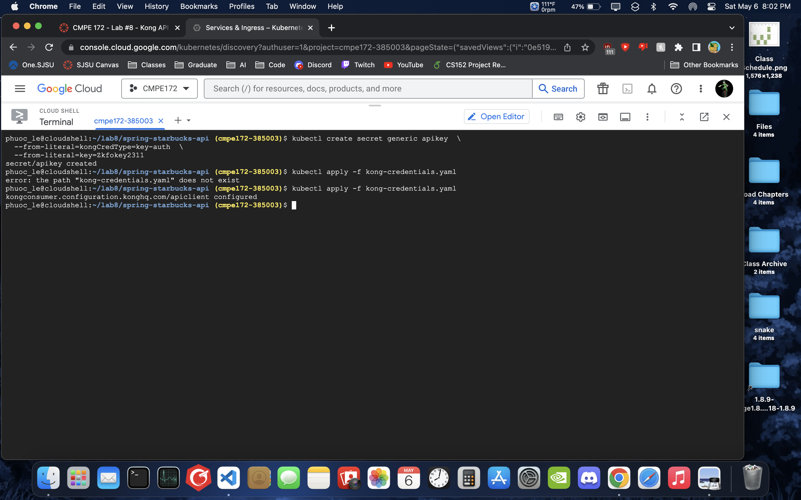

# CMPE 172 - Lab #8 Notes

## Kong API Gateway on Docker

    Kong API Gateway running on Docker. Ping test with and without the api key.

## Kong API Gateway on GKE

    To run the app on GKE, i first pushed the image of the app onto my docker hub. Then created a Kubernetes cluster and deploy the image from my docker hub.

    Deploy the load balancer for the app

    Test pining the api in jumpbox with curl

    Deploy kong api gate way in the cluster, connected to the load balancer

    Test pinging kong api gateway

    Test pinging kong ingress

    Create key for the kong api gateway

    Create kong secrete

    Pining the starbucks api through the kong pai gateway with the api key

