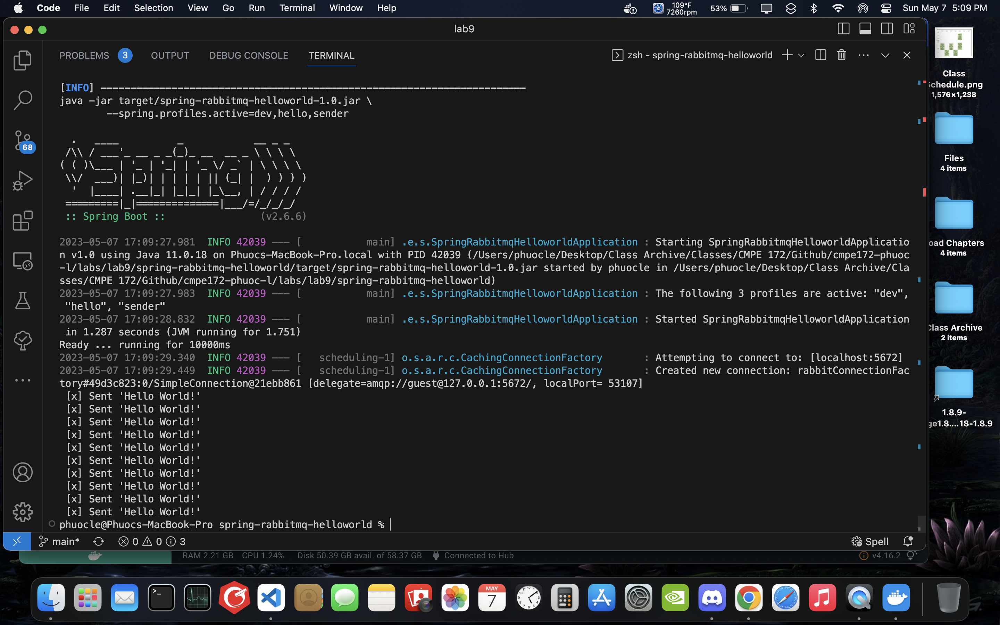
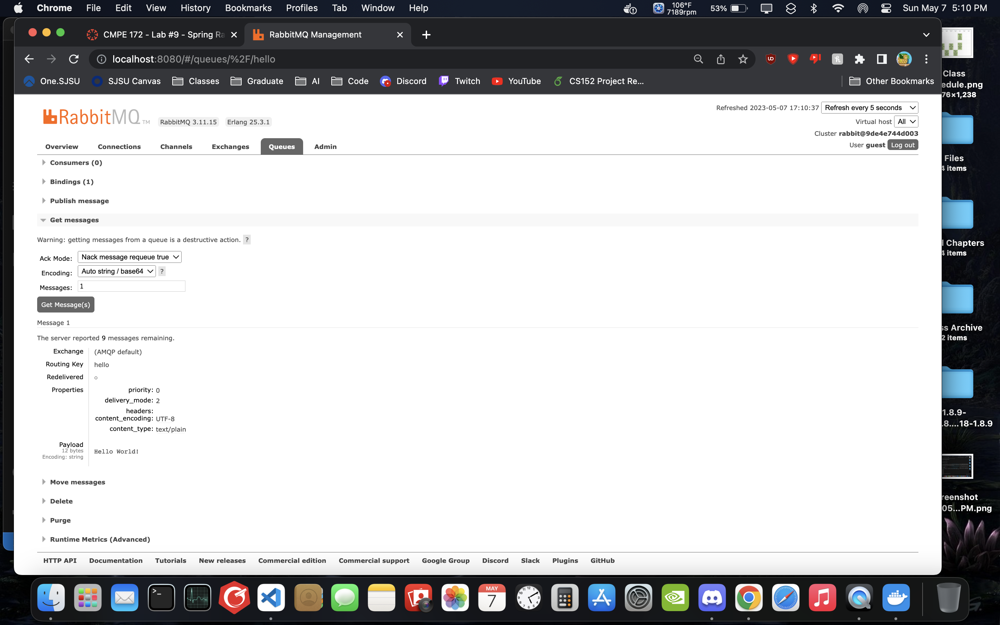

# CMPE 172 - Lab #9 Notes

## Messaging with RabbitMQ

    Sending messages with RabbitMQ

## Messaging with RabbitMQ - hello world

    Sending messages with RabbitMQ hello world

    RabbitMQ admin pages showing 10 messages from hello world app

    A sample message from the queue 

    Showing the hello world application receiving messages from the queue

## Messaging with RabbitMQ - worker

    Sending messages with RabbitMQ worker application

    A sample message from the worker queue on RabbitMQ admin

    Showing messages being received from the queue

## A discussion of what Spring Profiles are and how they can be used in your Project

- Spring profiles are profiles that can defines different environment profiles. These different profiles can be set and use in different context, such as testing, dev build or production build. Spring profiles can be used in the project to test different environment variables.

## A discussion of how RabbitMQ can be used in your Project (i.e. what's the use case?)

- RabbitMQ can be used in the project to create a queue for product order. When a user pay for a order, they have not actually gotten their order or drink yet. To simulate the real world of a customer paying for a drink, and then a employee making the drink and finally giving the drink to the customer, a queue can be implemented for worker to take paid orders and make drinks for the customer. 
