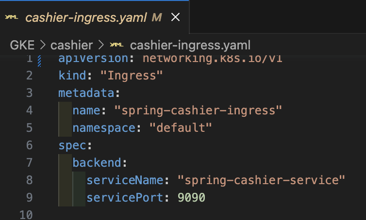
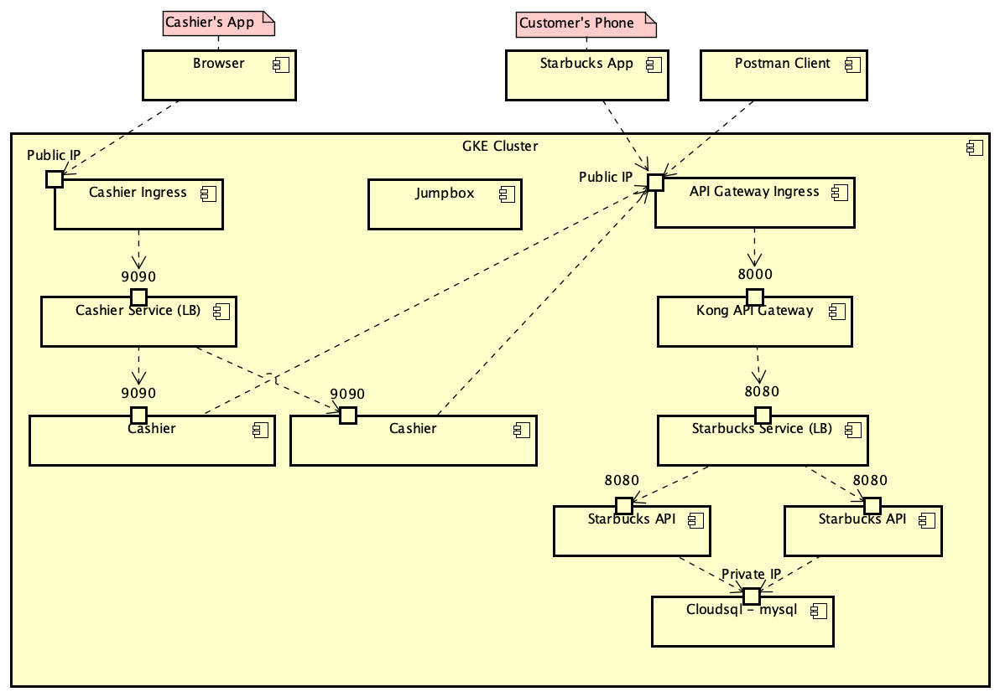

# CMPE 172 Project Journal

## Quick Notes For Project Requirements

    The architecture diagram can be found in the file: architecture.asta or architecture.png

    Manifests for docker is in project root docker-compose.yaml

    Manifest for all project apps for GKE is in the GKE folder

***

## Project Requirements

- **Cashier's App (25 points)**

  - **Port Node.js App to Spring MVC (required)**

    - **Web rendering must be done in View Templates**

        I made a new spring app called spring-cashier using the web spring initializer. To start off this app I copied over the template handlebar file in the starbucks-nodejs project. I then created new drop downs in the template for the chosing of drinks, milk and size.

        

    - **Controller must process JSON responses from API and pass to View via Models**

        The response from an api request is turned into a json string, and I used object mapper to map the json string into a order object where each value of the order can get extracted to form the message.

        

    - **Output and "Look and Feel" of Web UI must match that of Node.js App**

        Original template code was from the Node.js app, so look and feel should be similar in the new app.

    - **Implementation must not just use Rest Client example code (from instructor) as-is**

        I used the example in client code to make the api called, however I made changes to the code so that I can format the response message. I have also edit the code to do delete request for the clear order feature.

        

  - **Support Admin Logins for Starbucks Employees (5 points)**

    - **Must not store credentials in memory or hard code in source code**

        In order to not store any credentials in memory, I used jdbc session store and to store user login registration data, and log in users when they login. In the application.properties, i declared that jdbc is my session store for spring security, and I also set session initialization to be always, so that all the session tables will be created automatically when the app starts up.

        

    - **Should also include New Account Registration and Logout**

        As it is allowed by the professor, I took some of his code for the registration form. This code contains methods to created new user store it using jdbc session store and the webpage html itself.

        

  - **Support In Store Order Processing (20 points -- See Diagram Below)**

    - **See "Demo the following in your Video submission" below**

        To support in store order processing for the cashier app, when the user press the place order button, the order that they have got is sent to the api app and saved to the mysql database. This way all of the storage logic is handled by the api app and not the cashier app.

- **Scalable Cloud Deployment on GCP  (25 points)**

    In order to deploy the api and cashier application to GKE, I first build and pushed the app's images to my docker hub. I also need a cloudsql instance to store data for users, orders, and cards. Then I used Manifest yamls files for the deployment and service of the apps in GKE. (deployment and service yaml files for api and cashier can be found in the GKE folder)

  - **External Load Balancer as Ingress for Cashier's App (10 points)**

    The external load balancer for the cashier app is the ingress for the cashier app.

    

  - **Internal Load Balancer for Starbucks API behind Kong API Gateway (15 points)**

    The internal load balancer for the starbucks api is the service for the api app.

    

- **Implementation Uses Required Cloud Databases (25 points)**

  - **MySQL Database 8.0 (15 points)**

    - **Must use Cloud SQL (MySQL Option)**

        I ran an instance of cloudsql mysql in GCP with a private ip. Using this ip, I was able to connect the api app and cashier app to the database through passing in an environment variable.

    - **Update Starbucks API to use JPA with MySQL**

    In order for the starbucks api app to use jpa, you first mark any class you can to save by jpa into the database with the @entity annotation. In this case the api want cards and orders to be save in database, so you put the @entity annotation in their class definition. Next you make the repository class for the card and order class, and then you can use @autowire to connect the database to java card and order objects.

  - **RabbitMQ (10 points)**

    - **Must use GKE RabbitMQ Operator**

    - **Extend the Starbucks API to support async order processing (to use RabbitMQ)**

- **Starbucks API for Mobile App and Store Front (25 points)**

  - **Deployed with Kong API Gateway with API Key Authentication (10 points)**

    For the mobile app to have access to the api app that is running in GKE, it must have the api gateway ip and the api key. I am using the given jar file to run the mobile app, and in order to give it the correct information for the api, I need to edit the command used to run the mobile app.

    

  - **Implement RabbitMQ Check Order Status for "Drinks Available" (15 Points)**

    - **Async Request API to "Make the Drink" once Order has been Paid (i.e. put request into a Queue)**

    - **Async Check Order Status API to "Check Status of Drink" in the Starbucks Database**

    - **Will need a Background Worker Job (i.e. Spring Scheduler) to pick up Orders and Make Drinks**

    - **Background Worker should be a "Single Resilient POD" which auto restarts on crashes**

***

## Features

### Cashier App

For the cashier app, there are some features that was required for the project. The first is the implementation of the dropdowns for the choosing of drinks, milk, and size of the order. I did this by creating drop down menus with each option tied to a value and id, so when the user click place order, the values of each drop down is sent to the controller to handle. The cashier app have three buttons that different thing. the first is get order, which when pressed will send a get request with the register id to the api, which will then return the active order at that register. The next button is place order, which will send a post request to the api to place an order that hat register. The last is clear order which will remove the current order at the register. The cashier app also feature a register and login page where the user can make and account and log into the cashier app.

### Starbucks API

For the starbucks api, the main thing that I changed was the service code, Where I fixed the bug relating to the use of a hashmap to store orders locally in code while also saving to the mysql database. Because the code was using a hashmap to store data locally in code, it causes from issue when the app is scaled with a load balancer. For example when an order is created and the user is forwarded to another instance of the api, the new instance would reference its own local hashmap, and it might not match up with data from the previous api instance. To fix this issue, I had remove the hashmap completely and made it so that any reference made to an order object is queried from the database and not from a something local, so that all instance of the api will have access to the same data.

Another bug i had fixed in the api app is the cascading on-to-one relationship between the starbucks card and order. Part of the requirements was that a user can remove or clear an order from the register, but since there exist a cascading relationship between the starbucks card and order, if you delete an order from the database, it would also delete the card associated with it.

### Cloud Deployments

- **Design Notes on GitHub an Architecture Diagram of the overall Deployment.**

A user wanting to access a GKE application would first need to connect to the ingress or external load balancer of the app. This ingress have an external or public ip so the user could connect to it. Then the ingress will then connect the user to a service or the internal load balancer, where they will be serve to individual instances or pods of the application. This is correct for the cashier app, but for the api app, there is also the kong api gateway to manage request going to the api app.

- **How does your Solution Scale?  Can it handle > 1 Million Mobile Devices? Explain.**

My solution does scale, and I think it can handle quite a bit of traffic, just not sure about  more than one million devices. My app have a external and internal load balancer and if there are more traffic, I can simply deploy more apps and balancer to handle that traffic. The bottle neck might just be the processing speed of the database.

***

## Daily Journal Logs

### Entry 1 (April 24, 2023)

Link: [https://github.com/nguyensjsu/cmpe172-phuoc-l/commit/42cb14eed5684c043ddd75d5a1738647ca01f0c9](https://github.com/nguyensjsu/cmpe172-phuoc-l/commit/42cb14eed5684c043ddd75d5a1738647ca01f0c9)

- Started porting the starbucks-nodejs project file to a spring mvc version called spring-cashier. So far, this port have the html corrected from javascript code to html and thymeleaf. GetAction in controller should work, but all PostAction is not working. Will need to figure out how to talk to the starbucks-api to store any drink information.

### Entry 2 (April 25, 2023)

Link: [https://github.com/nguyensjsu/cmpe172-phuoc-l/commit/4cafab0e9086db1d559558b4e5222737b8a9a6c0](https://github.com/nguyensjsu/cmpe172-phuoc-l/commit/4cafab0e9086db1d559558b4e5222737b8a9a6c0)

- Worked on the UI and implemented dropdown menus for drink, milk, and size selection. Once the user click "place order" the application will send a post request to starbucks-api to save the order. Also implemented error code handling for when drinks have invalid sizes or when order already exist at a store/register. "get order" and "clear order" is not working yet, but should be easy to implement.

### Entry 3 (April 26, 2023)

Link: [https://github.com/nguyensjsu/cmpe172-phuoc-l/commit/0fe4ad711ed1a4239c903d377ed5f0edb0e920a4](https://github.com/nguyensjsu/cmpe172-phuoc-l/commit/0fe4ad711ed1a4239c903d377ed5f0edb0e920a4)

- Worked on lab 8 about kong api gateway to learn more on the topic before implementing it in the project.

### Entry 4 (April 27, 2023)

Link: [https://github.com/nguyensjsu/cmpe172-phuoc-l/commit/2c0b8e40bbc157e5fe11a999be055f07ff9c6b80](https://github.com/nguyensjsu/cmpe172-phuoc-l/commit/2c0b8e40bbc157e5fe11a999be055f07ff9c6b80)

- Worked on starbucks api to use mysql instead of h2 in-memory database.

### Entry 5 (May 4, 2023)

Link: [https://github.com/nguyensjsu/cmpe172-phuoc-l/commit/550354196aad155a6546e45fad317ed0fb58a8f4](https://github.com/nguyensjsu/cmpe172-phuoc-l/commit/550354196aad155a6546e45fad317ed0fb58a8f4)

- Worked on kong api gateway for the starbucks api, and got it working on docker with load balancer. The cashier app is still missing a register page and jdbc session to store credentials, and load balancer.

### Entry 6 (May 5, 2023)

Link: [https://github.com/nguyensjsu/cmpe172-phuoc-l/commit/ac17fccf120a0db6c4886cd7f4c3d7bbeebcf5ed](https://github.com/nguyensjsu/cmpe172-phuoc-l/commit/ac17fccf120a0db6c4886cd7f4c3d7bbeebcf5ed)

- Worked on spring cashier app to add jdbc session store with mysql, and the sign up and sign in pages.

### Entry 7 (May 6, 2023)

Link: [https://github.com/nguyensjsu/cmpe172-phuoc-l/commit/5f96473591a3af2dc53793d39c721b13c9ad9969](https://github.com/nguyensjsu/cmpe172-phuoc-l/commit/5f96473591a3af2dc53793d39c721b13c9ad9969)

- Worked on lab 8 with kong api gateway deployment to GKE to study for the project deployment to GKE. Also tested running the cashier on a load balancer on docker.

### Entry 8 (May 7, 2023)

Link: [https://github.com/nguyensjsu/cmpe172-phuoc-l/commit/114879d337779ae40dab0639ce4bae5cef146168](https://github.com/nguyensjsu/cmpe172-phuoc-l/commit/114879d337779ae40dab0639ce4bae5cef146168)

- Worked on lab 9 with RabbitMQ to study for its implementation in the project. Also created all the deployment yaml files for the cashier app and api app in preparation to deploy it to GKE. Also added the clear order feature to the cashier app, where the user can click clear order and any active order will be cleared from the database.

### Entry 9 (May 8, 2023)

Link: [https://github.com/nguyensjsu/cmpe172-phuoc-l/commit/4b390bec632ee2c118c84cb57dbf0b4808c32edf](https://github.com/nguyensjsu/cmpe172-phuoc-l/commit/4b390bec632ee2c118c84cb57dbf0b4808c32edf)

- More a little more on the yaml files for GKE deployment. Also started on updating the README.md and logging progress for Project requirements.

### Entry 10 (May 9, 2023)

Link: [https://github.com/nguyensjsu/cmpe172-phuoc-l/commit/ee3ef478148207c2b408483e94c4d8a5e22c095f](https://github.com/nguyensjsu/cmpe172-phuoc-l/commit/ee3ef478148207c2b408483e94c4d8a5e22c095f)

- Worked on api error with hashmap for storing order locally not working correctly when scaled. There are multiple way to fix this issue, one is to remove the hashmap entirely and only use order data from the mysql database. I went with another approach, where before using the hashmap in each method, just check for parity with the mysql database and match order data from the hashmap with that of the mysql database.

### Entry 11 (May 10, 2023)

Link: [https://github.com/nguyensjsu/cmpe172-phuoc-l/commit/6a185c09d6c54b7c1a069eb3d09b298ed3ca1933](https://github.com/nguyensjsu/cmpe172-phuoc-l/commit/6a185c09d6c54b7c1a069eb3d09b298ed3ca1933)

- Work a bit on deploying starbucks app to GKE. Have a little trouble on pushing images to docker hub, but got it solved. Planning on deploying the api today and maybe the rest of the apps later.

### Entry 12 (May 11, 2023)

Link: [https://github.com/nguyensjsu/cmpe172-phuoc-l/commit/012f427e01fa9be47b1628feb56f9fa52bfd40d8](https://github.com/nguyensjsu/cmpe172-phuoc-l/commit/012f427e01fa9be47b1628feb56f9fa52bfd40d8)

- Tried to get the api working with cloudsql, but run into a lot of trouble making it work. The api app is not create any tables in the starbucks database in the cloudsql instance. I have put the correct private ip, login name and password, but it is not creating the tables. The cashier app is working normally.

### Entry 13 (May 13, 2023)

Link: [https://github.com/nguyensjsu/cmpe172-phuoc-l/commit/0750cac95684b206224e531170b79dde175487d8](https://github.com/nguyensjsu/cmpe172-phuoc-l/commit/0750cac95684b206224e531170b79dde175487d8)

- API app not creating tables because it was an earlier build that was using hs. Builded latest version of api app and pushed to docker hub to deploy to GKE. The app is now working correctly. Also fixed bug in database relations, preventing the deletion of starbucks order without also automatically deleting linked starbucks card. Fixed this by removing cascading tag on the one to tone relationship of starbucks car and order.

***
